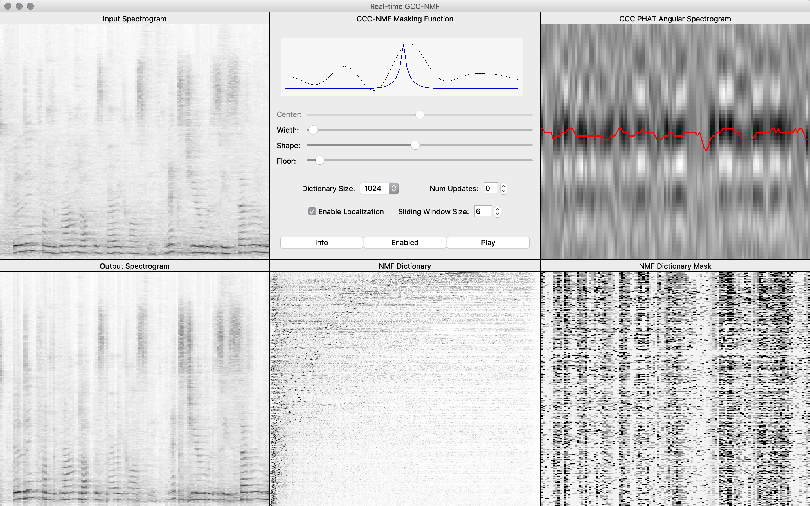
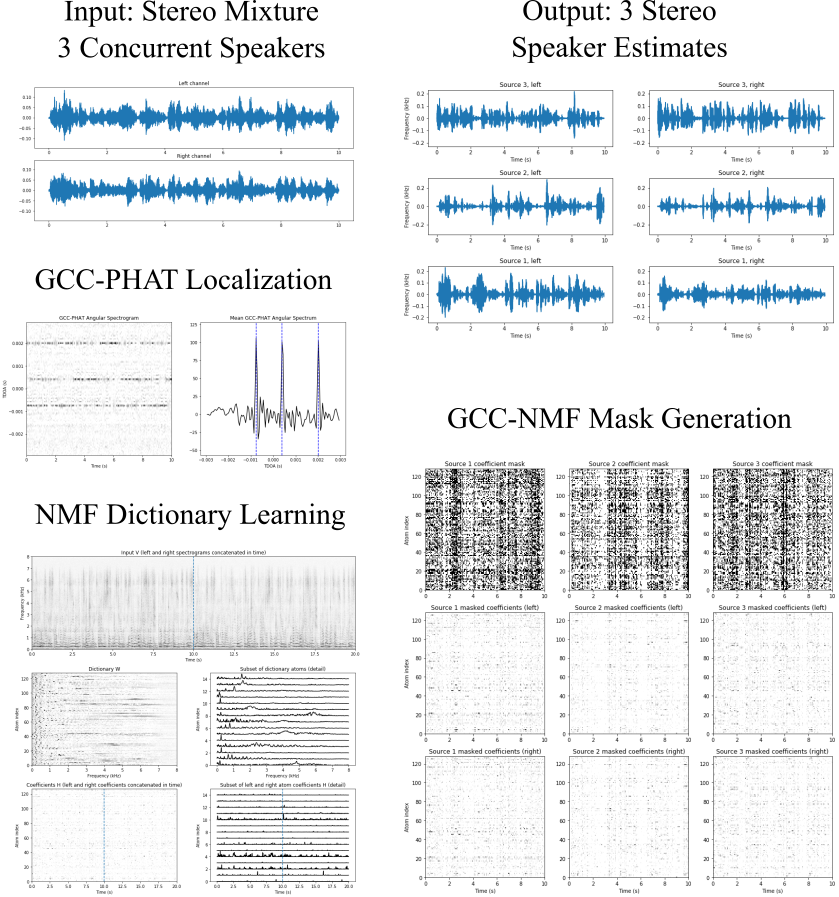
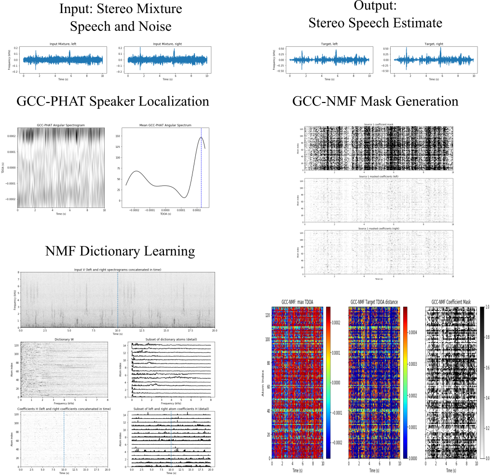
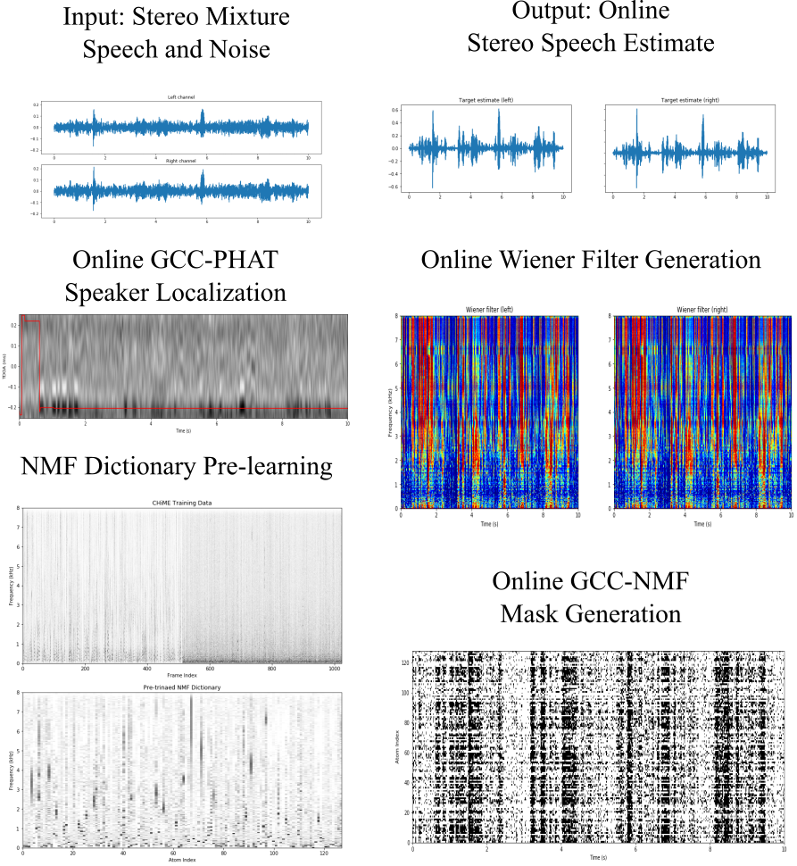
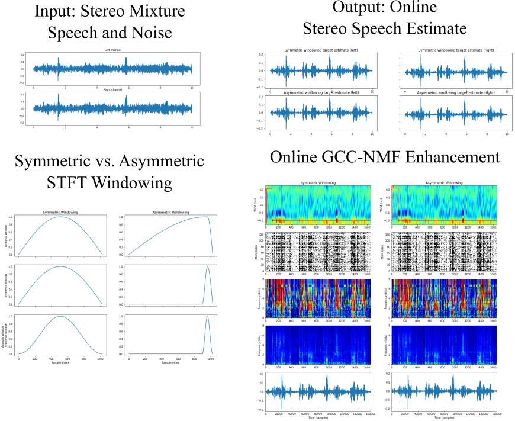

<!---
The MIT License (MIT)

Copyright (c) 2016 Sean UN Wood

Permission is hereby granted, free of charge, to any person obtaining a copy
of this software and associated documentation files (the "Software"), to deal
in the Software without restriction, including without limitation the rights
to use, copy, modify, merge, publish, distribute, sublicense, and/or sell
copies of the Software, and to permit persons to whom the Software is
furnished to do so, subject to the following conditions:

The above copyright notice and this permission notice shall be included in all
copies or substantial portions of the Software.

THE SOFTWARE IS PROVIDED "AS IS", WITHOUT WARRANTY OF ANY KIND, EXPRESS OR
IMPLIED, INCLUDING BUT NOT LIMITED TO THE WARRANTIES OF MERCHANTABILITY,
FITNESS FOR A PARTICULAR PURPOSE AND NONINFRINGEMENT. IN NO EVENT SHALL THE
AUTHORS OR COPYRIGHT HOLDERS BE LIABLE FOR ANY CLAIM, DAMAGES OR OTHER
LIABILITY, WHETHER IN AN ACTION OF CONTRACT, TORT OR OTHERWISE, ARISING FROM,
OUT OF OR IN CONNECTION WITH THE SOFTWARE OR THE USE OR OTHER DEALINGS IN THE
SOFTWARE.
--->

# GCC-NMF
GCC-NMF is a blind _source separation and denoising algorithm_ that combines the [GCC](http://ieeexplore.ieee.org/abstract/document/1162830/) spatial localization method with the [NMF](https://en.wikipedia.org/wiki/Non-negative_matrix_factorization) unsupervised dictionary learning algorithm. GCC-NMF has been used for stereo speech separation and enhancement in both offline and real-time settings. Though we have focused on speech applications so far, GCC-NMF is a _generic source separation and denoising algorithm_ and may well be applicable to other types of signals.

This GitHub repository provides:

1. A standalone **Python executable** to execute and visualize GCC-NMF in real-time.

   - [Real-time Speech Enhancement: RT-GCC-NMF](https://nbviewer.jupyter.org/github/seanwood/gcc-nmf/blob/master/notebooks/realtimeSpeechEnhancement.ipynb)
2. A series of **iPython notebooks** notebooks presenting GCC-NMF in tutorial style, building towards the low latency, real-time context:
   - [Offline Speech Separation](https://nbviewer.jupyter.org/github/seanwood/gcc-nmf/blob/master/notebooks/offlineSpeechSeparation.ipynb)
   - [Offline Speech Enhancement](https://nbviewer.jupyter.org/github/seanwood/gcc-nmf/blob/master/notebooks/offlineSpeechEnhancement.ipynb)
   - [Online Speech Enhancement](https://nbviewer.jupyter.org/github/seanwood/gcc-nmf/blob/master/notebooks/onlineSpeechEnhancement.ipynb)
   - [Low Latency Speech Enhancement](https://nbviewer.jupyter.org/github/seanwood/gcc-nmf/blob/master/notebooks/lowLatencySpeechEnhancement.ipynb)

#### Journal Papers

- Sean UN Wood, Jean Rouat, [*Unsupervised Low Latency Speech Enhancement with RT-GCC-NMF*](https://arxiv.org/abs/1904.03130), **IEEE Journal on Selected Topics in Signal Processing (JSTSP) Special Issue on Data Science: Machine Learning for Audio Signal Processing**, 2019.  
DOI: [10.1109/JSTSP.2019.2909193](https://doi.org/10.1109/JSTSP.2019.2909193)

- Sean UN Wood, Jean Rouat, Stéphane Dupont, Gueorgui Pironkov, [*Blind Speech Separation and Enhancement with GCC-NMF*](https://www.gel.usherbrooke.ca/rouat/publications/IEEE_ACMTrGCCNMFWoodRouat2017.pdf), **IEEE/ACM Transactions on Audio, Speech, and Language Processing (TASLP)**, vol. 25, no. 4, pp. 745–755, 2017.  
DOI: [10.1109/TASLP.2017.2656805](https://doi.org/10.1109/TASLP.2017.2656805)

#### Conference Papers
- Sean UN Wood and Jean Rouat, [*Towards GCC-NMF Speech Enhancement for Hearing Assistive Devices: Reducing Latency with Asymmetric Windows*](https://www.researchgate.net/profile/Sean_Wood7/publication/318814469_Towards_GCC-NMF_Speech_Enhancement_for_Hearing_Assistive_Devices_Reducing_Latency_with_Asymmetric_Windows/links/597ff39d0f7e9b8802ed2a6c/Towards-GCC-NMF-Speech-Enhancement-for-Hearing-Assistive-Devices-Reducing-Latency-with-Asymmetric-Windows.pdf), 1st International Workshop on 
Challenges in Hearing Assistive Technology, **CHAT 2017**.
- Sean UN Wood and Jean Rouat, [*Real-time Speech Enhancement with GCC-NMF*](https://www.researchgate.net/profile/Sean_Wood7/publication/318511757_Real-time_Speech_Enhancement_with_GCC-NMF/links/596ea657a6fdcc2416901891/Real-time-Speech-Enhancement-with-GCC-NMF.pdf), **Interspeech 2017**.
- Sean UN Wood and Jean Rouat, [*Real-time Speech Enhancement with GCC-NMF: Demonstration on the Raspberry Pi and NVIDIA Jetson*](https://www.researchgate.net/profile/Sean_Wood7/publication/318946628_Real-time_Speech_Enhancement_with_GCC-NMF_Demonstration_on_the_Raspberry_Pi_and_NVIDIA_Jetson/links/59872715aca27266ada22465/Real-time-Speech-Enhancement-with-GCC-NMF-Demonstration-on-the-Raspberry-Pi-and-NVIDIA-Jetson.pdf), **Interspeech 2017 Show and Tell Demonstrations**.
- Sean UN Wood and Jean Rouat, [*Speech Separation with GCC-NMF*](http://www.isca-speech.org/archive/Interspeech_2016/pdfs/1449.PDF), **Interspeech 2016**. 

## Real-time Speech Enhancement: RT-GCC-NMF
The [Real-time Speech Enhancement](https://nbviewer.jupyter.org/github/seanwood/gcc-nmf/blob/master/notebooks/realtimeSpeechEnhancement.ipynb) standalone Python executable is an implementation of the RT-GCC-NMF real-time speech enhancement algorithm. Users may 
interactively modify system parameters including the NMF dictionary size and GCC-NMF masking function parameters, where the effects on speech enhancement quality may be heard in real-time.

  
## Offline Speech Separation

The [Offline Speech Separation iPython notebook](https://nbviewer.jupyter.org/github/seanwood/gcc-nmf/blob/master/notebooks/offlineSpeechSeparation.ipynb) shows how GCC-NMF can be used to separate multiple concurrent speakers in an offline fashion. The NMF dictionary is first learned directly from the mixture signal, and sources are subsequently separated by attributing each atom at each time to a single source based on the dictionary atoms' estimated time delay of arrival (TDOA). Source localization is achieved with GCC-PHAT.

## Offline Speech Enhancement

The [Offline Speech Enhancement iPython notebook](https://nbviewer.jupyter.org/github/seanwood/gcc-nmf/blob/master/notebooks/offlineSpeechEnhancement.ipynb) demonstrates how GCC-NMF can can be used for offline speech enhancement, where instead of multiple speakers, we have a single speaker plus noise. In this case, individual atoms are attributed either to the speaker or to noise at each point in time base on the the atom TDOAs as above. The target speaker is again localized with GCC-PHAT.

## Online Speech Enhancement
The [Online Speech Enhancement iPython notebook](https://nbviewer.jupyter.org/github/seanwood/gcc-nmf/blob/master/notebooks/onlineSpeechEnhancement.ipynb) demonstrates an online variant of GCC-NMF that works in a frame-by-frame fashion to perform speech enhancement in real-time. Here, the NMF dictionary is pre-learned from a different dataset than used at test time, NMF coefficients are inferred frame-by-frame, and speaker localization is performed with an accumulated GCC-PHAT method.

## Low Latency Speech Enhancement
In the [Low Latency Speech Enhancement iPython notebook](https://nbviewer.jupyter.org/github/seanwood/gcc-nmf/blob/master/notebooks/lowLatencySpeechEnhancement.ipynb) we extend the online GCC-NMF approach to reduce algorithmic latency via asymmetric STFT windowing strategy. Long analysis windows maintain the high spectral resolution required by GCC-NMF, while short synthesis windows drastically reduce algorithmic latency with little effect on speech enhancement quality. Algorithmic latency can be reduced from over 64 ms using traditional symmetric STFT windowing to below 2 ms with the proposed asymmetric STFT windowing, provided sufficient computational power is available.

